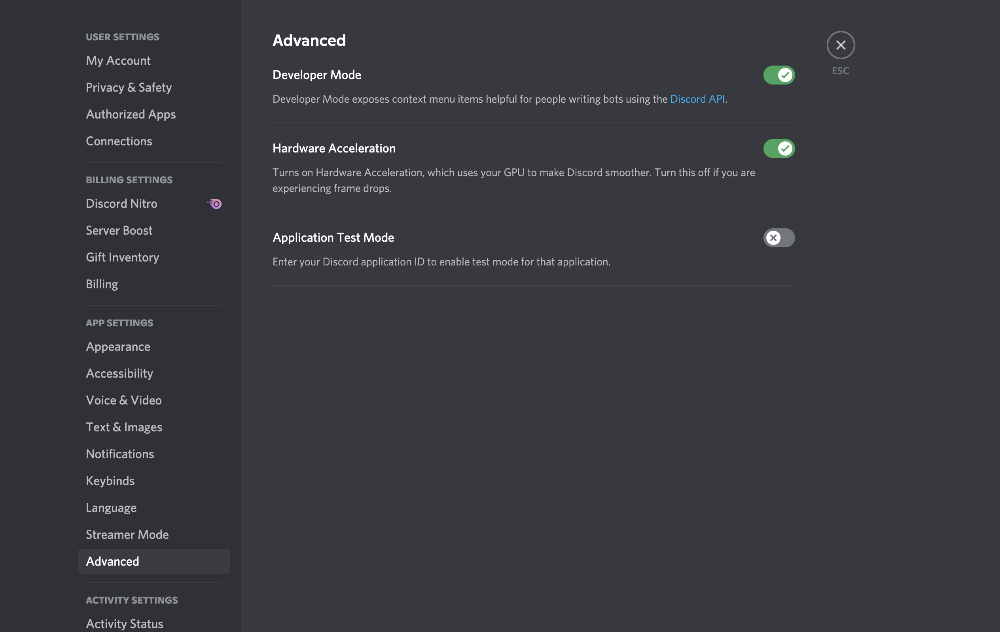

# Building and Testing Mad Hatter

This document describes how to set up your development environment to build and test Mad Hatter.
It also explains the basic mechanics of using `git`, `node`, and `yarn`.

* [Prerequisite Software](#prerequisite-software)
* [Setup Discord developer application](#setup-discord-developer-application)
* [Setup local environment file](#setup-local-environment-file)

## Prerequisite Software

Before you can build and test Mad Hatter, you must install and configure the
following products on your development machine:

* [Git](https://git-scm.com/) and/or the [GitHub app](https://desktop.github.com/) (for Mac and Windows);
  [GitHub's Guide to Installing Git](https://help.github.com/articles/set-up-git) is a good source of information.

* [Node.js](https://nodejs.org), (version specified in the engines field of [`package.json`](../package.json)) which is used to run a development web server,
  run tests, and generate distributable files.

* [Yarn](https://yarnpkg.com) (version specified in the engines field of [`package.json`](../package.json)) which is used to install dependencies.

* [Docker Desktop](https://www.docker.com/products/docker-desktop) is used to run the application in a containzerized environment for a reliable and consistent local development experience.

* [Robo3T](https://robomongo.org/) is used as a GUI for MongoDB.

* [GNU Make](https://www.gnu.org/software/make/) is a tool used to streamline local application start-up.

## Setup Discord developer application

### Create personal developer bot

See [Setting up a bot application](https://discordjs.guide/preparations/setting-up-a-bot-application.html) for a complete guide.

Create a Discord application at the [Discord Developer Portal](https://discord.com/developers/applications).

In your Discord application's settings, navigate to the "Bot" tab. Scroll down to the section titled "Privileged Gateway Intents", and enable `Presence Intent` and `Server Members Intent`.

To retrieve the appplication ID and public key, navigate to the "General Information" tab:


To retrieve the bot token, naviage to the "Bot" tab:


### Create invite link
See [Bot invite links](https://discordjs.guide/preparations/adding-your-bot-to-servers.html#bot-invite-links) for a complete guide.

An invite link must be generated that can be used by a server admin to invite the bot into their Discord server. Replace `<YOUR_CLIENT_ID_HERE>` in the following link with your client ID. This value can be found in the "OAuth2" tab under the section "Client Information". Send this link, with your client ID, to a developer on the Mad Hatter team to have the bot invited to the Bankless Bot Garage.

Invite link:
```
https://discord.com/api/oauth2/authorize?client_id=<YOUR_CLIENT_ID_HERE>&permissions=399163616342&scope=applications.commands%20bot
```


### Enable Developer Mode

Open Discord User Settings, navigate to Advanced, and enable Developer Mode:


## Setup local environment file
Create a `.env` file in the project root directory using `.env.template` as a template.

| Variable | Description|
| --- | --- |  
| DISCORD_BOT_APPLICATION_ID | Copy value of `APPLICATION ID` from Discord Developer Portal under your applications "General Information" tab. |
| DISCORD_BOT_PUBLIC_KEY | Copy value of `PUBLIC KEY` from Discord Developer Portal under your applications "General Information" tab. |
| DISCORD_BOT_TOKEN | Copy value of `TOKEN` from Discord Developer Portal under your applications "Bot" tab. |
| DISCORD_OWNER_ID | With developer mode enabled in Discord, right-click on your username in the server member list and click "Copy ID". |
| DISCORD_SERVER_ID | With developer mode enabled in Discord,, right click on the server name in the top-left corner and click "Copy ID". |
| NOTION_TOKEN | Only required if building or testing Notion commands. Can be generated from Notion integrations page. An admin will need to the integration to the QA Notion. |
| MONGODB_PREFIX | Omit if using Docker to build the application. |
| MONGODB_USERNAME | Omit if using Docker to build the application. |
| MONGODB_PASS | Omit if using Docker to build the application. | 
| MONGODB_CLUSTER | Omit if using Docker to build the application. |


Example `.env` file (example uses random fake keys):
```
NODE_ENVIRONMENT=development
SENTRY_ENVIRONMENT
DISCORD_BOT_APPLICATION_ID=89840079503347765166
DISCORD_BOT_PUBLIC_KEY=0vn048hi4p4uh1j3qwkdw1zd9jrhkn4uumjbulrye9v7zgu64b
DISCORD_BOT_TOKEN=ZYW4fB62E9a7txQps3ijh1D4hGY4vQgq3KL0qh05F0NEjV6xO9
DISCORD_OWNER_ID=9939075523428180
DISCORD_SERVER_ID=851552281249972254
NOTION_TOKEN=secret_BFy9vBYebeZwR2a98UmZMgQINYzThqtrPcjamO
```

The Notion and Discord related variables in [.env.qa](../.env.qa) should be copied into `.env` if the bot is being deployed and tested in the Bankless Bot Garage Discord server.
